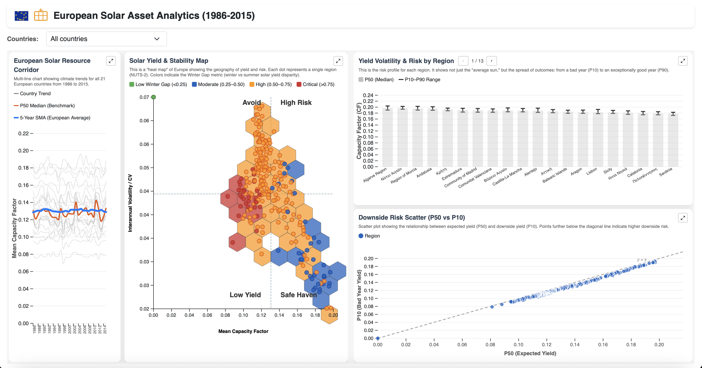

### Summary
European Solar Asset Analytics (1986–2015)
Data-driven dashboard for evaluating the long-term performance and risk profile of solar assets across Europe. Visualizes climate trends, seasonal yield gaps, interannual volatility, and downside risks using metrics such as Capacity Factor, Winter Gap, and Coefficient of Variation. Enables informed investment decisions by quantifying both expected yields and extreme scenarios.

### Backend
- **Runtime:** Node.js
- **Framework:** Express.js (v4.22.3)
- **Database:** ClickHouse (columnar OLAP database)
- **Driver:** `@apla/clickhouse` (v1.6.4) for query execution
- **Middleware:** `cors` for cross-origin requests
- **Dev tool:** `nodemon` for automatic server restart during development

### Frontend
- **Visualization:** D3.js v7 (loaded via CDN)
- **Hexbin plugin:** d3-hbin v0.2.2 (loaded via CDN)
- **Styling:** Bootstrap 5 (loaded via CDN)
- **Language:** Vanilla JavaScript (no build tools, no frameworks like React/Vue)
- **Structure:** Everything bundled in a single `index.html` file

### Data Layer
- **Source:** PVGIS solar radiation data (1986–2015)
- **Storage:** ClickHouse database with a raw table `data.pvgis` containing hourly solar capacity factor records
- **Analytical views:** 8 ClickHouse views for pre-aggregated metrics:
  - `v_invest_metrics` — yield (mean CF), risk (coefficient of variation), winter gap (seasonality)
  - `v_region_seasonal_bins` / `v_country_seasonal_bins` — value distribution histograms for summer and winter
  - `v_region_percentiles` / `v_country_percentiles` — P10, P50, P90, P99 capacity factors
  - `v_country_annual_stats` / `v_country_annual_trend` — yearly average capacity factors for trend analysis

### Architecture
- **Pattern:** Simple Express API server serving both REST endpoints and static frontend files
- **Data flow:** Browser → Express API → ClickHouse → aggregated views → JSON response → D3.js rendering
- **Deployment:** No build step required. Runs on any VPS with Node.js and ClickHouse, or locally

